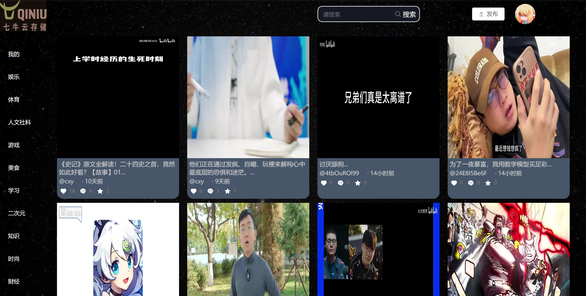

<div align="center">

  <h1>QNY-BackEnd</h1>

  <p>
    An online video website using Qiniu Cloud storage and video framing technology! 
  </p>


<!-- Badges -->

</div>

<br />

<!-- Table of Contents -->
# :notebook_with_decorative_cover: Table of Contents

- [About the Project](#star2-about-the-project)
    * [Screenshots](#camera-screenshots)
    * [Tech Stack](#space_invader-tech-stack)
    * [Features](#dart-features)
- [Getting Started](#toolbox-getting-started)
- [Postrequisites](#bangbang-postrequisites)
- [Contributing](#wave-contributing)
- [Contact](#handshake-contact)
- [Acknowledgements](#gem-acknowledgements)

<!-- About the Project -->
## :star2: About the Project

<!-- Screenshots -->
### :camera: Screenshots

<div align="center"> 
  
</div>

<!-- TechStack -->
### :space_invader: Tech Stack

<ul>
  <li><a href="https://spring.io/projects/spring-boot">SpringBoot</a></li>
  <li><a href="https://baomidou.com/">MyBatis PLUS</a></li>
  <li><a href="https://www.mysql.com/cn/">MySQL</a></li>
  <li><a href="https://maven.apache.org/">Apache Maven</a></li>
</ul>

<!-- Features -->
### :dart: Features

- Account system
    * Login, Logout and Signin.
    * picture verification code.
- Home page
    * Content classification: Video content classification page, such as popular videos and sports channels.
    * Video framing: video cover display.
- Search
    * Enter keywords in the search bar to find specific videos, users.
      The search results will display relevant videos and relevant users.
- Upload video
    * Upload your homemade short video.
    * Add an introduction and label.
- Personal information
    * View and edit personal profile information.
    * View your uploaded videos, favorite videos and view history.
- Video Page
    * Video playback: play, pause, progress bar drag and drop.
    * Video switching: You can scroll through videos using the up and down keys.
    * Volume adjustment, full screen, playback speed adjustment, download.
    * Add watermark.
    * Follow other users.
    * View Like, Comments, Share, Star of videos.
    * Like, Comments, Share, Star the video.

<!-- Getting Started -->
## 	:toolbox: Getting Started

Clone the project

```bash
  git clone https://github.com/Joy-aa/videoPlayerBackEnd.git
```

Go to the project directory

```bash
  cd videoPlayerBackEnd
```

Run project

```bash
  mvn spring-boot:run
```

<!-- Postrequisites -->
### :bangbang: Postrequisites

After running this project, you should ensure that you have cloned our frontend project locally.
Please refer to https://github.com/Joy-aa/videoPlayerFrontEnd/README.md

The project will be http://localhost:8080 Run on.
You can access this URL in a browser to view the application.

<!-- Contributing -->
## :wave: Contributing

<a href="https://github.com/Joy-aa/videoPlayerBackEnd/graphs/contributors">
  
</a>

Contributions are always welcome!

See `README.md` for ways to get started.

<!-- Contact -->
## :handshake: Contact

Yuxin Wang - 22251259@qq.com

Jia Wang -

Xinyuan Cheng -

Project Link: [https://github.com/Joy-aa/videoPlayerBackEnd](https://github.com/Joy-aa/videoPlayerBackEnd)

<!-- Acknowledgments -->
## :gem: Acknowledgements

- [Qiniu](https://www.qiniu.com/)
